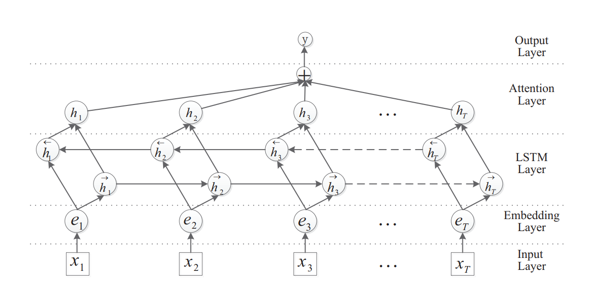

# Bi-LSTM with Attention
---
Tensorflow implementation of [Attention-Based Bidirectional Long Short-Term Memory Networks for Relation Classification](https://www.aclweb.org/anthology/P16-2034).  
This is Baseline model for multi-senti classification task .

<br/>


- Illustration of a model architecture for sentence classification  
  

<br/>


## Description

- **Input Layer**
  - Create Sentence Piece Tokenizer and vocabulary lists
  - Tokenize input sentences and indexed lists
- **Embedding Layer**
  - Get embedding vector from pre-trained Word2vec model
- **LSTM Layer**
  - There exists bi-directional LSTM cells; forward and backward
  - They can be concatenated or added to get representation of each token
- **Attention Layer**
  - Attention weights are taken from linear projection and non-linear activation
  - Final sentence representation is weighted sum of all token representations
- **Output Layer**
  - Final classification output is derived from simple dense and softmax layer

<br/>


## Requirements

- python 3.7
- sentencepiece==0.1.83
- tensorflow==1.14.0
- gensim
- numpy
- pandas

<br/>


## config
```yml
    model_name = 'AttLSTM'
    model_save_path = './ckpt/BiLSTMAtt'
    result_save_path = './result/BiLSTMAtt'

    learning_rate = 1.
    l2_scale = 1e-5
    embedding_size = 100
    hidden_size = 100
    dropout_keep_probs = [.7, .7, .5]
    epochs = 50
    batch_size = 10
    summary_step = 50

    use_pre_weight = True
    static_pre_weight = False
    use_peepholes = True
    bilstm_merge_mode = 'add'    # or 'concat'
    att_activation = 'tanh'      # or 'relu'
    optimizer = 'adadelta'       # or 'adam'
    lr_schedule = 'constant'     # or 'standard'

    train_data_path = './data/korean_single_train.csv'
    dev_data_path = './data/korean_single_dev.csv'
    raw_data_path = './data/korean_single_turn_utterance_text.csv'
    tokenizer_path = './data/m32k.model'
    vocab_path = './data/m32k.vocab'
    w2v_path = './ckpt/wv/w2v_pretrained'
    num_classes = 7
    vocab_size = 32000
    max_len = 128
```

<br/>


## Result

To be updated  

<br/>


## Reference

[Attention-Based Bidirectional Long Short-Term Memory Networks for Relation Classification](https://www.aclweb.org/anthology/P16-2034)

